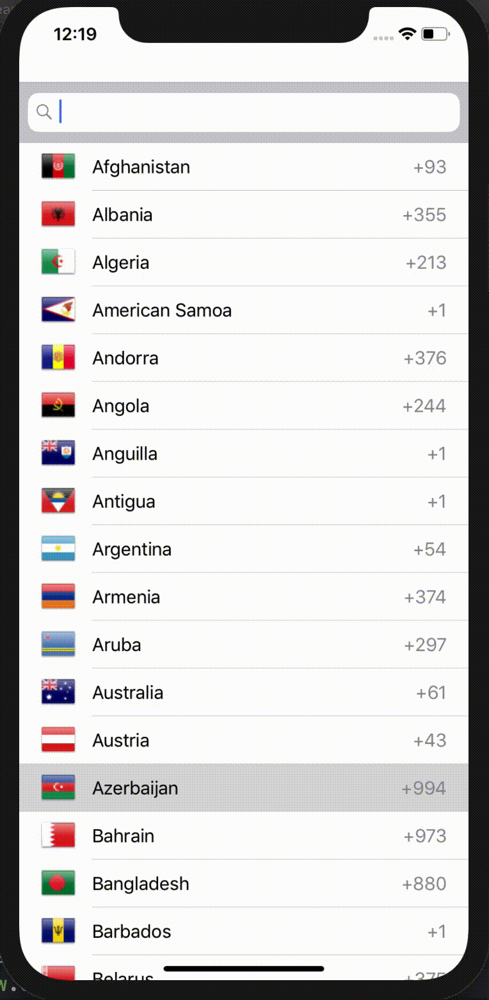

# SearchableList

Swift project to list down available countries dial Code and allows search. 

## What is the unique about this project 
  As shown in the below demo to list country dial code we used flags, in majority of times to show flags we use pngs but this project uses emojis 🙀, yes emojis. 
  
## How it works?
  Basically in iOS from Local we can get the list of country code for the country code we can generate the emoji (unicode) for more info [click here](https://bendodson.com/weblog/2016/04/26/emoji-flags-from-iso-3166-country-codes-in-swift/)
  
- Thanks to Ben Dodson & Benjamin Esham for Awesome article. 

## Componentes used 
1. UITableView 
2. UISearchBar 

